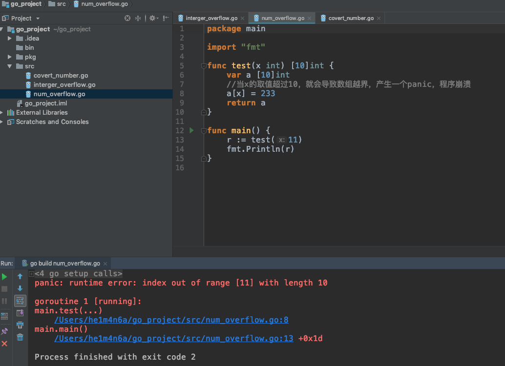
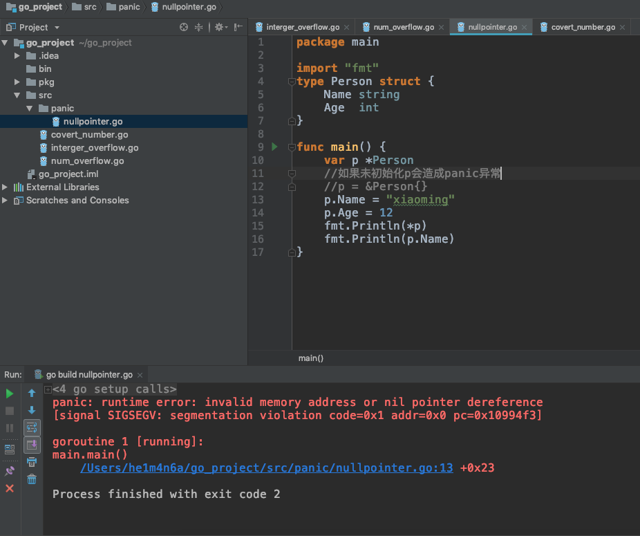

# Panic

Go在编译的时候会捕获很多错误，但是很多错误只能在运行时候检查，比如`数组越界`、`空指针`等。这些运行时错误会引起panic。

当发生panic异常，程序中断，并立即执行goroutine中的defer函数，随后**程序崩溃并输出日志信息**。除了运行时的panic异常，直接调用内置的panic函数也会引发panic异常。正常情况下调用go的错误处理机制就好，panic的误用或者异常引起可导致程序崩溃，造成dos攻击。

## 案例1：数组越界<div id="panic1"></div>

```go
package main

import "fmt"

func test(x int) [10]int {
	var a [10]int
	//当x的取值超过10，就会导致数组越界，产生一个panic，程序崩溃
	a[x] = 233
	return a
}

func main() {
	r := test(11)
	fmt.Println(r)
}
```



### 检测

- 使用ide找到源码中所有的`[]`，判断是否存在数组越界的情况。

## 案例2：空指针<div id="panic2"></div>

```go
package main

import "fmt"
type Person struct {
   Name string
   Age  int
}

func main() {
   var p *Person
   //如果未初始化p会造成panic异常
   //p = &Person{}
   p.Name = "xiaoming"
   p.Age = 12
   fmt.Println(*p)
   fmt.Println(p.Name)
}
```



### 检测

- 查找所有使用 ***** 进行指针取引用的相关代码，判断对应的变量是否有nil的校验。

## 案例3：除0导致panic<div id="panic3"></div>

`go vet`可以在编译时做些安全检测，但是一般除数不是硬编码数字的，所以编译期间无法检测出，导致panic。

**示例代码：**

```go
package main

func main() {
    fm := 0
    fmt.Println(1/fm)
}
```

### 检测

- 通过搜索"/"找到除法运算相关代码，看是否存在0作为分母的情况。

## 案例4：GoSDK导致的panic<div id="panic4"></div>

除了我们自己代码不规范导致的数组越界panic，一些内置或者外部的gosdk也会导致panic。

**示例代码：**

```go
package main

import "encoding/binary"

func main() {
    binary.BigEndian.Uint32([]byte{1,2,3})
}
```

漏洞原因：

 `src/encoding/binary/binary.go`定义了很多大端、小端转化的函数

```
func (bigEndian) Uint32(b []byte) uint32 {
    _ = b[3]
    return uint32(b[3]) | uint32(b[2])<<8 | uint32(b[1])<<16 | uint32(b[0])<<24
}
```

传入参数**b数组**长度如果小于4（下标取3，对应长度为4），则会导致`panic: runtime error: index out of range` 

### 检测

1. go代码中搜索`binary.LittleEndian.`和`binary.BigEndian.`，找到使用binary库中函数的代码片段 
2. 使用IDE查看binary库种函数的具体实现，判断传入的参数是否存在越界
