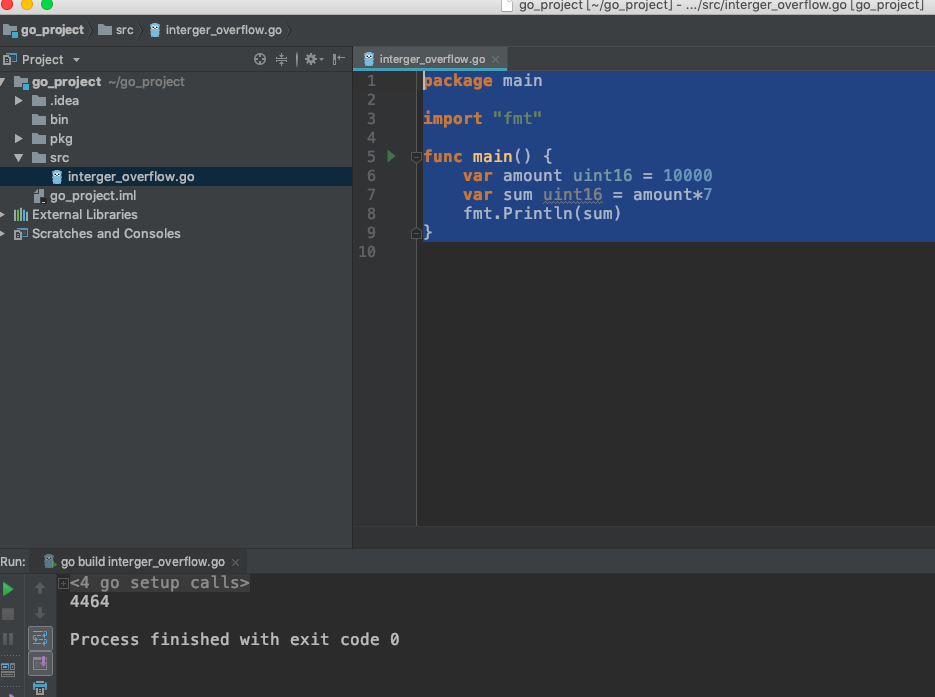
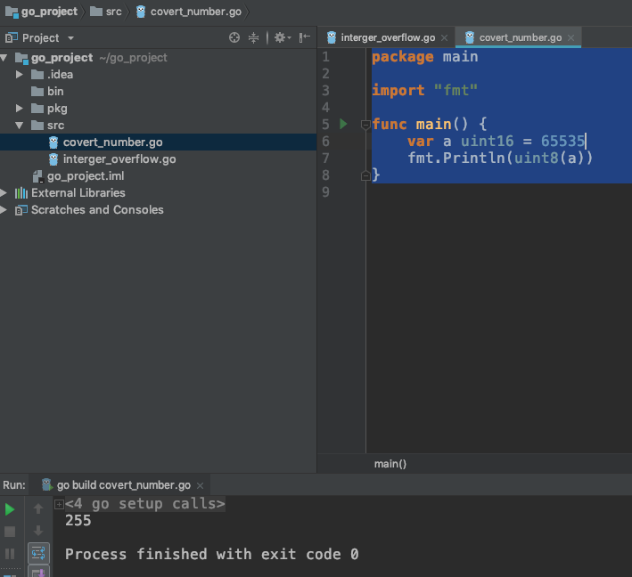

# 整数溢出

## 案例1：溢出数字边界<div id="intOverFlow1"></div>

```go
package main

import "fmt"

func main() {
	var amount uint16 = 10000
	var sum uint16 = amount*7
	fmt.Println(sum)
}
```


	
原理：`unit16`无符号最大能表示65536`(2^16-1)`，当结果70000超过最大值导致结果丢失。

### 检测

- 通读代码并找出所有有关数字操作的代码，查看是否做了边界判断。

## 案例2：大整型转小整型<div id="intOverFlow2"></div>

```go
package main

import "fmt"

func main() {
	var a uint16 = 65535
	fmt.Println(uint8(a))
}
```



### 检测

- 通读代码并找出所有有关数字操作的代码，查看是否做了整型转换。

## 案例3：有符号和无符号互转<div id="intOverFlow3"></div>

```go
package main

import "fmt"

func main() {
	var a uint16 = 65535
	fmt.Println(int16(a))
}
```

### 检测

- 通读代码并找出所有有关数字操作的代码，查看是否有有符号整型和无符号整型互转的操作。

